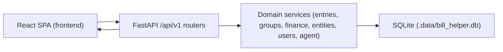

# High-Level Data Flow and Graph Model (Current MVP)

This document summarizes end-to-end flows for the current implementation: manual ledger writes, graph grouping, dashboard reads, and agent review-gated proposals.

## System View

Bill Helper is a local-first, single-user app with a React frontend, FastAPI backend, and SQLite storage.

## Graph-Based Entry Management

Entries are graph nodes and links are typed graph edges:

- Node table: `entries`
- Edge table: `entry_links`
- Component identity table: `entry_groups`

Group IDs are backend-derived (not user-assigned):

1. Load all active (non-deleted) entries.
2. Build an undirected adjacency map from `entry_links`.
3. Run DFS to identify connected components.
4. Assign one `group_id` per component.
5. Persist updated group IDs in one transaction.

Implemented in `backend/services/groups.py`.

## Storage Model (High Level)

Primary tables:

- `entries`: core expense/income records, entity refs, soft-delete flags, group membership, markdown note body.
- `entry_links`: typed directional links (`RECURRING`, `SPLIT`, `BUNDLE`).
- `entry_groups`: connected-component identities for linked entries.
- `accounts`, `account_snapshots`: account metadata and reconciliation checkpoints.
- `users`: normalized owners used by entries/accounts.
- `entities`: normalized names for `from`/`to` and account-linked entities.
- `tags`, `entry_tags`: tag catalog and many-to-many entry mapping.
- `taxonomies`, `taxonomy_terms`, `taxonomy_assignments`: reusable categorical system for entities/tags.

Agent review tables:

- `agent_threads`, `agent_messages`, `agent_runs`, `agent_tool_calls`
- `agent_change_items`, `agent_review_actions`

Note: entry-level status has been removed; review state lives in `agent_change_items`.

## End-to-End Data Flow

### Manual Write Path (Entry Create/Update)

1. Frontend submits to `/api/v1/entries` or `/api/v1/entries/{id}`.
2. Popup editor serializes notes into `markdown_body`.
3. Router validates payload with Pydantic schemas.
4. Services normalize tags/entities/users and resolve references.
5. SQLAlchemy writes rows to SQLite and commits.
6. Frontend invalidates query caches and refreshes dependent views.

### Graph Mutation Path (Links + Entry Delete)

1. Link create (`POST /entries/{id}/links`) or delete (`DELETE /links/{id}`) mutates `entry_links`.
2. Entry delete (`DELETE /entries/{id}`) soft-deletes the row and removes related links.
3. Backend runs `recompute_entry_groups`.
4. Graph reads (`GET /groups/{group_id}`) reflect updated topology.

### Agent-Assisted Write Path (Review-Gated)

1. User sends message to `/api/v1/agent/threads/{thread_id}/messages` (background run) or `/api/v1/agent/threads/{thread_id}/messages/stream` (SSE token stream).
2. Agent runtime executes read/proposal tools.
3. Proposed creates are persisted as `agent_change_items` (`PENDING_REVIEW`).
4. Human reviewer approves/rejects individual items.
5. On approval, apply handlers create domain rows (including entries) and record review actions.

### Read Path (Dashboard + Reconciliation)

1. Frontend calls `/api/v1/dashboard?month=YYYY-MM` and account reconciliation endpoints.
2. Finance service computes:
   - runtime-configured currency monthly KPIs
   - daily spending split (daily vs non-daily tag classification)
   - monthly trend, breakdowns (`from`, `to`, `tag`)
   - weekday distribution, largest expenses, projection
   - account reconciliation deltas
3. Frontend renders tabbed interactive charts/tables from the aggregated payload.

## Module Map

- API routers:
  - `backend/routers/entries.py`
  - `backend/routers/links.py`
  - `backend/routers/groups.py`
  - `backend/routers/dashboard.py`
  - `backend/routers/accounts.py`
  - `backend/routers/agent.py`
  - `backend/routers/settings.py`
- Core services:
  - `backend/services/groups.py`
  - `backend/services/entries.py`
  - `backend/services/entities.py`
  - `backend/services/users.py`
  - `backend/services/runtime_settings.py`
  - `backend/services/taxonomy.py`
  - `backend/services/finance.py`
- Agent services:
  - `backend/services/agent/runtime.py`
  - `backend/services/agent/tools.py`
  - `backend/services/agent/review.py`
  - `backend/services/agent/change_apply.py`
- Models/contracts:
  - `backend/models.py`
  - `backend/schemas.py`
- Frontend access/render paths:
  - `frontend/src/lib/api.ts`
  - `frontend/src/lib/queryInvalidation.ts`
  - `frontend/src/pages/EntriesPage.tsx`
  - `frontend/src/pages/EntryDetailPage.tsx`
  - `frontend/src/pages/DashboardPage.tsx`
  - `frontend/src/pages/AccountsPage.tsx`
  - `frontend/src/features/accounts/*`
  - `frontend/src/pages/PropertiesPage.tsx`
  - `frontend/src/features/properties/*`
  - `frontend/src/components/agent/AgentPanel.tsx`
  - `frontend/src/components/agent/panel/*`

## Operational Impact

- Migration path includes:
  - `0001_initial`
  - `0002_entities_and_entry_entity_refs`
  - `0003_entity_category`
  - `0004_users_and_account_entity_links`
  - `0005_remove_attachments`
  - `0006_agent_append_only_core`
  - `0007_taxonomy_core`
  - `0008_agent_run_usage_metrics`
  - `0009_remove_entry_status`
  - `0010_runtime_settings_overrides`
  - `0011_remove_openrouter_runtime_settings_fields`
- Operational commands:
  - `uv run alembic upgrade head`
  - `uv run bill-helper-api`
  - `uv run --extra dev pytest`
  - `uv run python scripts/check_docs_sync.py`
- Relevant environment variables:
  - `BILL_HELPER_DATABASE_URL`
  - `BILL_HELPER_CURRENT_USER_NAME`
  - `BILL_HELPER_DEFAULT_CURRENCY_CODE`
  - `BILL_HELPER_DASHBOARD_CURRENCY_CODE`
  - `BILL_HELPER_AGENT_MODEL`
  - provider credentials for selected model (for example `OPENAI_API_KEY`, `ANTHROPIC_API_KEY`, `OPENROUTER_API_KEY`)

## Current Constraints and Limitations

- Group recomputation is global over active entries (not incremental).
- Link uniqueness is directional, while grouping treats connectivity as undirected.
- Entry deletion is soft-delete; related link rows are physically removed.
- Dashboard analytics use runtime-configured currency selection (`/settings` override, else env default).
- No auth/permissions boundaries (single-user local mode).
