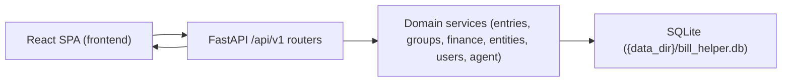

# High-Level Data Flow and Group Model (Current MVP)

This document summarizes end-to-end flows for the current implementation: manual ledger writes, first-class typed groups, dashboard reads, and agent review-gated proposals.

## System View

Bill Helper is a local-first multi-user app with a React frontend, FastAPI backend, and SQLite storage.

## Typed Group-Based Entry Management

Groups are first-class records. Topology is derived from direct membership plus group type:

- Group table: `entry_groups`
- Membership table: `entry_group_members`
- Entry table: `entries`

Direct graph rules:

1. Users create a named group with `group_type`.
2. Users add direct members as entries or child groups.
3. Backend validates depth-1 nesting and no-sharing rules.
4. `GET /groups/{group_id}` derives graph nodes and edges from the current direct membership set.

Derived edge semantics:

- `BUNDLE`: fully connected graph over direct members
- `SPLIT`: one optional `PARENT` member with directed edges to `CHILD` members
- `RECURRING`: chronological chain ordered by representative descendant date

Implemented in `backend/services/groups.py`.

## Storage Model (High Level)

Primary tables:

- `entries`: core expense/income/transfer records, entity refs, soft-delete flags, markdown note body.
- `entry_groups`: first-class named typed groups.
- `entry_group_members`: direct membership rows connecting a group to either an entry or a child group.
- `accounts`, `account_snapshots`: account metadata and reconciliation checkpoints.
- `users`: normalized owners used by entries/accounts/groups/filter groups.
- `entities`: normalized names for `from`/`to` and account-linked entities.
- `tags`, `entry_tags`: tag catalog and many-to-many entry mapping.
- `filter_groups`: per-user saved analytics filters with recursive rule definitions.
- `taxonomies`, `taxonomy_terms`, `taxonomy_assignments`: reusable categorical system for entities/tags.
- `sessions`: password-backed bearer sessions stored as hashed token digests.

Agent review tables:

- `agent_threads`, `agent_messages`, `agent_runs`, `agent_tool_calls`
- `agent_change_items`, `agent_review_actions`
- `agent_threads.owner_user_id` scopes the agent timeline and all nested run resources to a specific user

Note: entry-level status has been removed; review state lives in `agent_change_items`.

## End-to-End Data Flow

### Manual Write Path (Entry Create/Update)

1. Frontend submits to `/api/v1/entries` or `/api/v1/entries/{id}`.
2. Popup editor serializes notes into `markdown_body`.
3. Optional `direct_group_id` and `direct_group_member_role` are sent from the same modal when the user assigns a direct group inline.
4. Router validates payload with Pydantic schemas.
5. Services normalize tags/entities/users, then apply or clear direct group membership through the group service.
6. SQLAlchemy writes rows to SQLite and commits.
7. Frontend invalidates query caches and refreshes dependent views.
8. Entry reads expose `direct_group`, `direct_group_member_role`, and `group_path`; new entries still default to ungrouped.

### Group Mutation Path

1. Group create, rename, delete, add-member, or remove-member mutates `entry_groups` and/or `entry_group_members`.
2. Backend validates membership ownership, depth-1 nesting, and group-type invariants.
3. Graph reads (`GET /groups`, `GET /groups/{group_id}`) derive counts, nodes, and edges from the current membership tree.
4. Entry detail reads reflect updated `direct_group` and `group_path`.

### Agent-Assisted Write Path (Review-Gated)

1. User sends message to `/api/v1/agent/threads/{thread_id}/messages` (background run) or `/api/v1/agent/threads/{thread_id}/messages/stream` (SSE token stream).
2. Agent runtime executes read/proposal tools.
3. Proposed creates are persisted as `agent_change_items` (`PENDING_REVIEW`).
4. Human reviewer approves/rejects individual items.
5. On approval, apply handlers create domain rows (including entries) and record review actions.
6. Agent-created entries remain ungrouped until a user assigns them through the groups workspace.

### Read Path (Dashboard + Account Reconciliation)

1. Frontend calls `/api/v1/dashboard?month=YYYY-MM` and account reconciliation endpoints.
2. Finance service computes:
   - runtime-configured currency monthly KPIs
   - saved-filter-group month totals
   - daily and monthly expense series grouped by saved filter groups
   - monthly trend, breakdowns (`from`, `to`, `tag`)
   - weekday distribution, largest expenses, projection
   - account reconciliation interval summaries for the account workspace
3. Frontend renders dashboard charts/tables from the aggregated payload and renders account reconciliation in the accounts workspace.

### Filter-Group Configuration Path

1. Frontend calls `/api/v1/filter-groups`.
2. Backend provisions the caller's built-in default groups if they do not exist yet.
3. Users inspect or edit recursive include/exclude rules with nested `AND`/`OR` groups.
4. Dashboard reads consume those saved definitions on later requests.

## Module Map

- API routers:
  - `backend/routers/entries.py`
  - `backend/routers/groups.py`
  - `backend/routers/filter_groups.py`
  - `backend/routers/dashboard.py`
  - `backend/routers/accounts.py`
  - `backend/routers/agent.py`
  - `backend/routers/settings.py`
- Core services:
  - `backend/services/groups.py`
  - `backend/services/entries.py`
  - `backend/services/entities.py`
  - `backend/services/users.py`
  - `backend/services/runtime_settings.py`
  - `backend/services/taxonomy.py`
  - `backend/services/filter_groups.py`
  - `backend/services/filter_group_rules.py`
  - `backend/services/finance.py`
- Agent services:
  - `backend/services/agent/runtime.py`
  - `backend/services/agent/runtime_loop.py`
  - `backend/services/agent/tool_runtime.py`
  - `backend/services/agent/read_tools/`
  - `backend/services/agent/proposals/`
  - `backend/services/agent/tool_args/`
  - `backend/services/agent/proposal_patching.py`
  - `backend/services/agent/tools.py` (thin facade)
  - `backend/services/agent/reviews/`
  - `backend/services/agent/apply/`
- Models/contracts:
  - `backend/models_finance.py`
  - `backend/models_agent.py`
  - `backend/schemas_finance.py`
  - `backend/schemas_agent.py`
- Frontend access/render paths:
  - `frontend/src/lib/api.ts`
  - `frontend/src/lib/queryInvalidation.ts`
  - `frontend/src/pages/EntriesPage.tsx`
  - `frontend/src/pages/EntryDetailPage.tsx`
  - `frontend/src/pages/GroupsPage.tsx`
  - `frontend/src/components/GroupGraphView.tsx`
  - `frontend/src/components/GroupEditorModal.tsx`
  - `frontend/src/components/GroupMemberEditorModal.tsx`
  - `frontend/src/pages/DashboardPage.tsx`
  - `frontend/src/pages/AccountsPage.tsx`
  - `frontend/src/features/accounts/*`
  - `frontend/src/pages/PropertiesPage.tsx`
  - `frontend/src/features/properties/*`
  - `frontend/src/features/agent/AgentPanel.tsx`
  - `frontend/src/features/agent/panel/*`

## Operational Impact

- Migration path includes:
  - `0001_initial`
  - `0002_entities_and_entry_entity_refs`
  - `0003_entity_category`
  - `0004_users_and_account_entity_links`
  - `0005_remove_attachments`
  - `0006_agent_append_only_core`
  - `0007_taxonomy_core`
  - `0008_agent_run_usage_metrics`
  - `0009_remove_entry_status`
  - `0010_runtime_settings_overrides`
  - `0011_remove_openrouter_runtime_settings_fields`
  - `0012_remove_related_link_type`
  - `0013_add_account_markdown_body`
  - `0014_remove_account_institution_type`
  - `0015_add_agent_tool_call_output_text`
  - `0016_add_user_memory_to_runtime_settings`
  - `0017_rename_tag_category_taxonomy`
  - `0018_add_tag_description`
  - `0019_add_transfer_entry_kind`
  - `0020_add_agent_message_attachment_original_filename`
  - `0021_add_agent_run_context_tokens`
  - `0022_agent_run_events_and_tool_lifecycle`
  - `0023_add_agent_provider_config`
  - `0024_entity_root_accounts`
  - `0025_user_memory_json_list`
  - `0026_entry_groups_v2`
- `0032_add_filter_groups`
- `0033_multi_user_security`
- Operational commands:
  - `uv run alembic upgrade head`
  - `uv run python scripts/bootstrap_admin.py --name <user> --password <pass>`
  - `uv run bill-helper-api`
  - `uv run pytest`
  - `uv run python scripts/check_docs_sync.py`
- Relevant environment variables:
  - `BILL_HELPER_DATABASE_URL`
  - `BILL_HELPER_DEFAULT_CURRENCY_CODE`
  - `BILL_HELPER_DASHBOARD_CURRENCY_CODE`
  - `BILL_HELPER_AGENT_MODEL`
  - provider credentials for selected model (for example `OPENAI_API_KEY`, `ANTHROPIC_API_KEY`, `OPENROUTER_API_KEY`)

## Current Constraints and Limitations

- app auth is still prototype-grade and limited to admin/non-admin roles
- group nesting depth is capped at one
- child groups cannot be shared across multiple parents
- edges are derived only; there is no explicit edge storage or arbitrary edge editor
- dashboard analytics use runtime-configured currency selection (`/settings` override, else env default)
